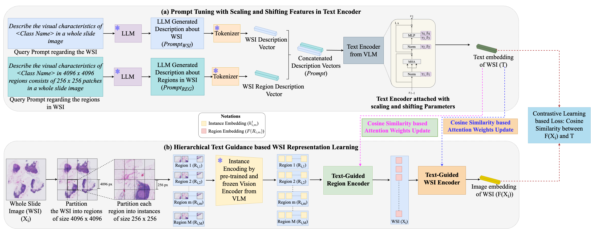

# Parameter-efficient Prompt Tuning and Hierarchical Textual Guidance for Few-shot Whole Slide Image Classification (HIPSS)


> **Accepted to CVPR 2026 Workshop on Medical Reasoning with Vision Language Foundation Models (Med-Reasoner)**       
> Jayanie Bogahawatte, Sachith Seneviratne, Saman Halgamuge


<p align="center">
  
</p>

> [CVF Open Access](https://openaccess.thecvf.com/content/CVPR2026W/Med-Reasoner/html/Bogahawatte_Parameter-efficient_Prompt_Tuning_and_Hierarchical_Textual_Guidance_for_Few-shot_Whole_CVPRW_2026_paper.html)
> 
> [arxiv](https://arxiv.org/abs/2603.21504)

## Datasets

Download the datasets from the below-mentioned links.

- Camelyon16 Dataset: https://camelyon17.grand-challenge.org/Data/
- TCGA-Lung Dataset: https://portal.gdc.cancer.gov/
- UBC-OCEAN Dataset: https://www.kaggle.com/competitions/UBC-OCEAN


## Pre-trained VLM

We used the [CONCH](https://github.com/mahmoodlab/CONCH) as our VLM. Download the [checkpoint](https://huggingface.co/datasets/david4real/FOCUS/blob/main/conch.pth) and place it in a desired location.

## Pre-processing with CLAM

---
- Download or clone the CLAM repository. (https://github.com/mahmoodlab/CLAM.git)
- Run the below code-snippet to pre-process the data and create `4096 x 4096` regions. Run this for each dataset. 
- This code will create `.h5` files.

```
python create_patches_fp.py \
        --source WSI_image_folder_path \
        --save_dir h5_files_save_folder_path \
        --preset presets/bwh_biopsy.csv \
        --patch_size 4096 \
        --step_size 4096 \
        --seg \
        --patch \
        --stitch
```

## Feature Extraction

---

- Generate the feature representations for `256 x 256` patches in `4096 x 4096` regions using:

  - `feature_extraction_camelyon16.py` for Camelyon16 Dataset.
  - `feature_extraction_tcga.py` for TCGA-Lung Dataset.
  - `feature_extraction_ubc.py` for UBC-OCEAN Dataset.

## Train HIPSS Model

---

- To enable the Scaling and Shifting Features (SSF)-based tuning in the text encoder of the VLM, navigate to the `conch_extended/open_clip_custom/transformer_extended.py` file lines `434 - 438` and modify the below values accordingly.

    - For Camelyon16 dataset and TCGA-Lung dataset:
        ```
          tuning_layers=2,
          init_ssf=True
        ```

    - For UBC-OCEAN dataset:
      ```
         tuning_layers=8,
         init_ssf=True
      ```
- To train the HIPSS model run the following:
```
python HIPSS_train.py \
    --opt adam \
    --lr 1e-4 \
    --results_dir results_directory \
    --n_classes 2 \
    --epochs 100 \
    --folds 3
```